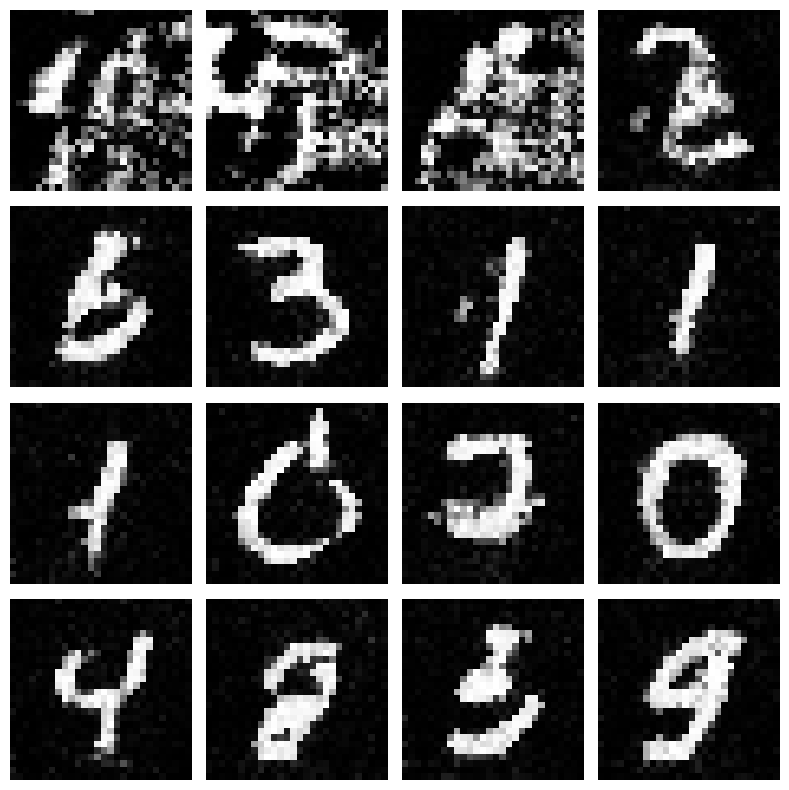

# Rapport TP sur les Energy-Based Models (EBM)

Dans ce TP, nous avons étudié le Joint Energy-Based Model (JEM), une extension des Energy-Based Models (EBM). Le JEM combine de façon élégante deux approches complémentaires : la modélisation générative et la classification discriminative.

## Méthode utilisée

### Energy-Based Models (EBM)

Un EBM modélise une distribution de probabilité à travers une fonction d'énergie paramétrée par un réseau neuronal :

$$p_{\theta}(x) = \frac{e^{-E_{\theta}(x)}}{Z(\theta)}$$

La fonction d'énergie $E_\theta(x)$ attribue un score scalaire à chaque donnée $x$. La fonction de partition $Z(\theta)$ sert de constante de normalisation, mais est difficile à calculer explicitement. Dans ce paradigme, une énergie faible correspond à une forte probabilité, tandis qu'une énergie élevée indique une faible probabilité.

### Joint Energy-Based Model (JEM)

Le JEM enrichit l'approche en intégrant une tâche de classification supervisée. Il définit la probabilité conditionnelle comme :

$$p_{\theta}(y|x) = \frac{e^{f_{\theta}(x)[y]}}{\sum_{y'} e^{f_{\theta}(x)[y']}}$$

Les $f_{\theta}(x)$ représentent les logits produits par un réseau neuronal et la classification s'effectue via une fonction softmax classique.

## Architecture du modèle

L'architecture implémentée comprend un extracteur CNN pour apprendre des représentations avec des couches convolutives utilisant l'activation **Swish** pour éviter le problème du gradient évanescent. Le modèle produit deux sorties distinctes : une sortie scalaire (énergie) et une sortie vectorielle (logits de classification).

L'architecture peut être schématisée ainsi :

```
CNN_layers → Flatten → {
  fc_energy (énergie scalaire)
  fc_class (logits de classification)
}
```

## Fonctionnement (Entraînement)

L'entraînement combine deux objectifs principaux. Le premier est la loss de classification qui utilise la cross-entropy classique pour superviser les logits :
$$\text{Loss}_{class} = \text{CrossEntropy}(f_{\theta}(x), y)$$

Le second est la loss générative qui utilise la Divergence Contrastive pour séparer les énergies réelles et fausses :
$$\text{Loss}_{CD} = E_{fake} - E_{real}$$

Les échantillons générés sont obtenus via MCMC (Langevin Dynamics) avec buffer (95% réutilisés, 5% bruit aléatoire).

Une régularisation est également appliquée pour assurer la stabilité de l'énergie via une contrainte quadratique :
$$\text{Loss}_{reg} = \alpha \cdot (E_{real}^2 + E_{fake}^2)$$

La loss totale combinée est simplement la somme de ces trois composantes :
$$\text{Loss}_{totale} = \text{Loss}_{class} + \text{Loss}_{CD} + \text{Loss}_{reg}$$

## Échantillonnage par Langevin Dynamics

La méthode d'échantillonnage utilise la dynamique de Langevin :
$$x_{t+1} = x_t - \alpha \nabla_x E_{\theta}(x_t) + \eta_t,\quad \eta_t \sim N(0, \sigma^2)$$

Cette approche utilise le gradient de l'énergie pour améliorer progressivement les échantillons. Un buffer est maintenu pour améliorer la diversité des échantillons générés.

## Résultats et Visualisation

Des échantillons générés de haute qualité sont obtenus après plusieurs étapes de Langevin Dynamics (typiquement 2000 étapes). 
Les résultats de classification sont évalués avec une précision mesurée sur un ensemble de validation.
Voila les resultat que l'on obtient apres 10 epochs d'entrainement sur le dataset MNIST:


